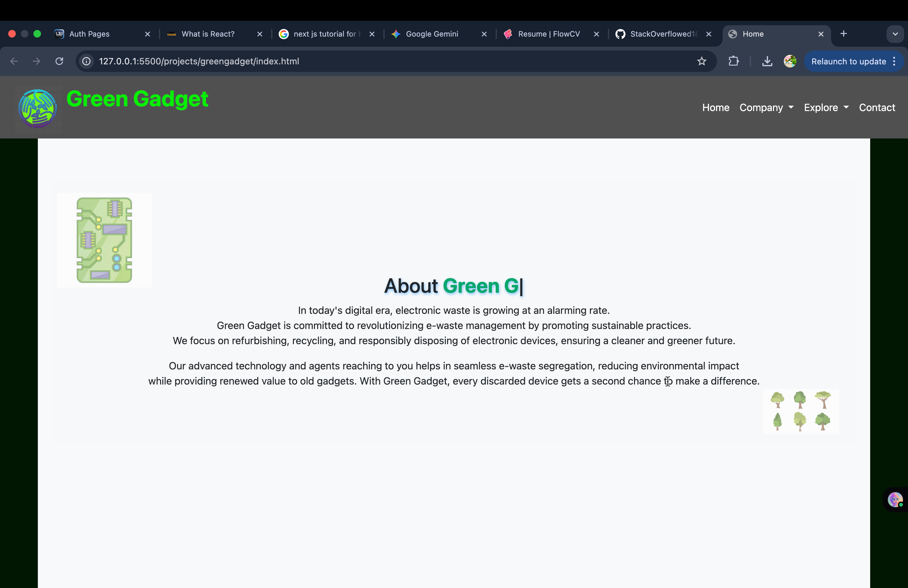
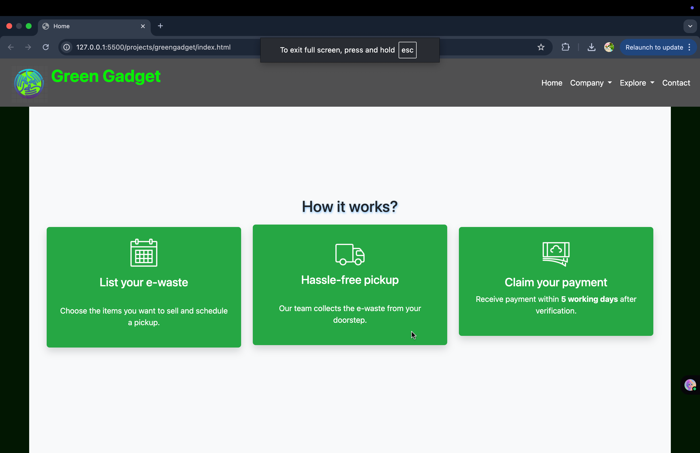
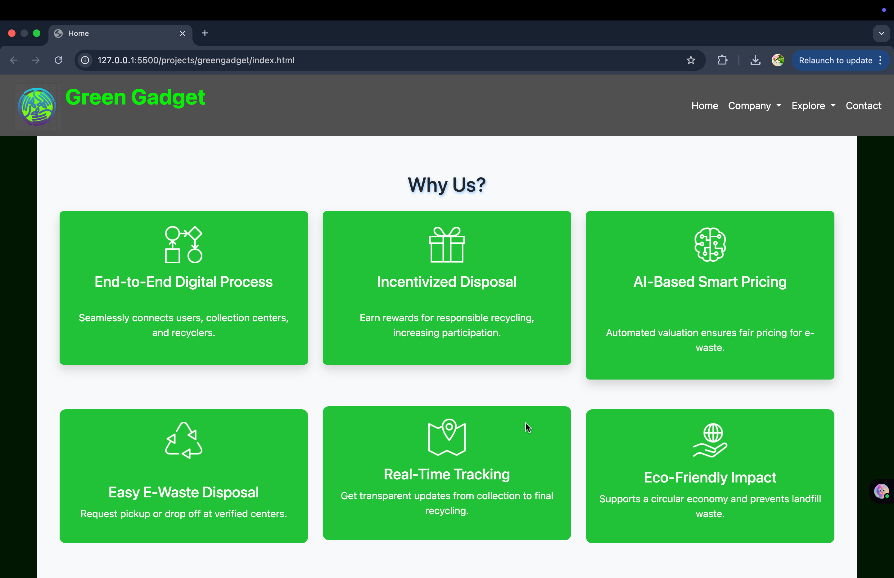
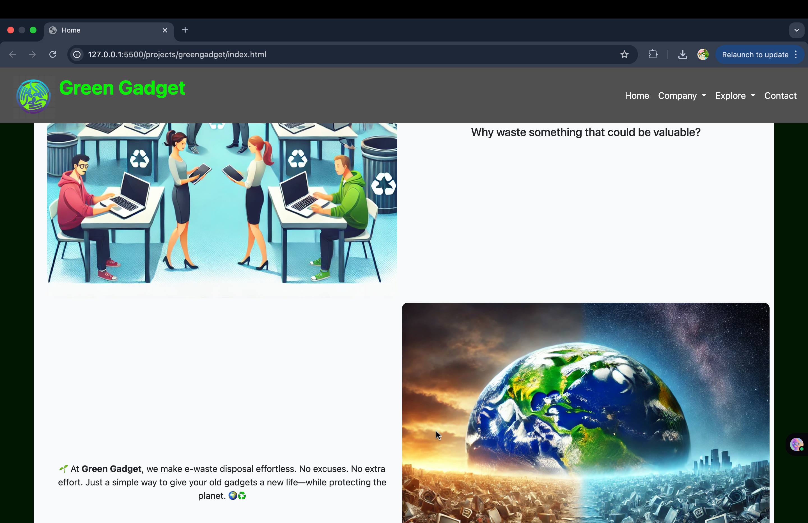
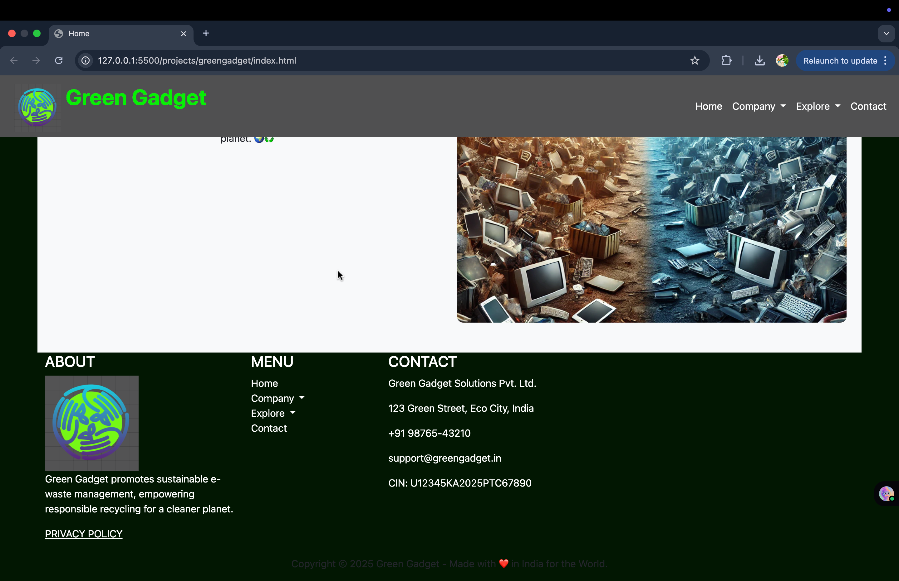
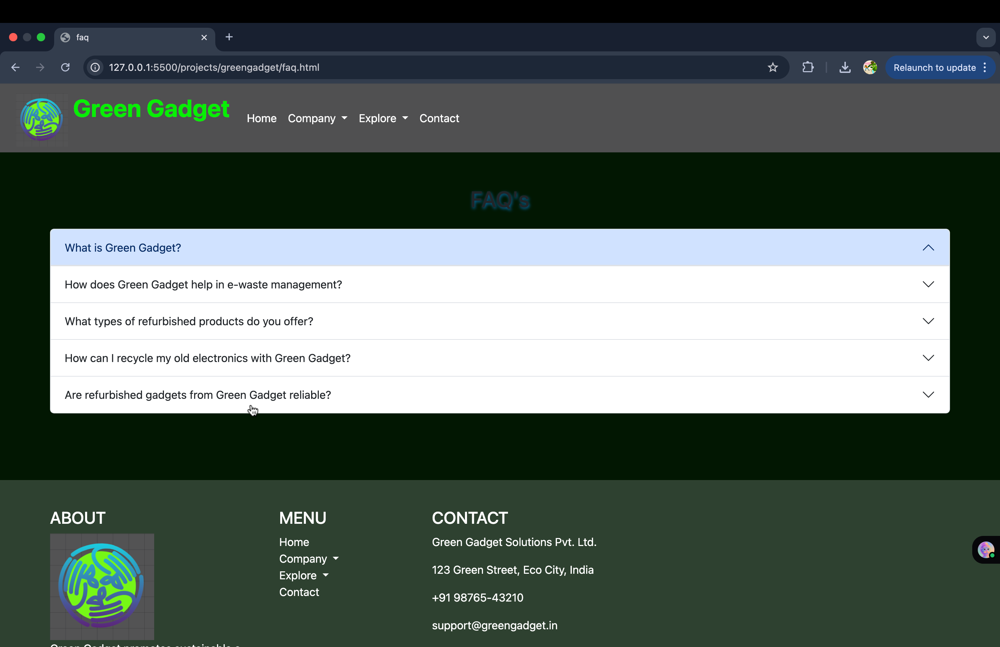

# Green Gadget 🍀 🚛
We’re excited to present our innovative solution tackling the e-waste crisis caused by rapid tech growth and short device lifespans. With e-waste expected to reach <strong> 74M metric tons </strong> by 2030, we aim to create a sustainable impact using technology. Let’s build a greener future! 🌍<br>
# 🔧 Tech Stack
Our solution is built with a clean and lightweight tech stack for maximum accessibility and ease of contribution:

🌐 Frontend – Developed using HTML, CSS, and JavaScript, ensuring fast performance and broad browser compatibility.

🐍 Backend – Powered by Python Flask, providing a robust and scalable API for handling all backend logic.

🗂️ Database – MongoDB is used to efficiently manage and store dynamic data such as user submissions and recycling logs.

<br><br><br>
 # 🌍 Why Green Gadget? 
We believe in tech for good. Green Gadget isn't just a platform — it's a movement toward responsible digital practices. Whether you're a tech enthusiast, environmentalist, or someone who just wants to make a difference — you’re invited to be a part of this initiative.

<br><br>
<hr>
<br>

# Project Pictures

<p align="center"> Home page fig{i}</p>
<hr>
<br>

<p align="center"> About Section fig{ii}</p>
<hr>
<br>

<p align="center"> How it works? Section fig{iii}</p>
<hr>
<br>

<p align="center"> Why us? Section fig{iv}</p>
<hr>
<br>


<p align="center"> Engagement increasing Section fig{v}</p>
<hr>
<br>


<p align="center">footer {vi} </p>
<hr>
<br>


<p align="center">faq {vi}</p>
<hr>
<br>
</br>
</br>
<hr>
</br>
</br>
🚀 Getting Started
To run this project locally:

1.  **Clone the repository**

    ```bash
    git clone https://github.com/StackOverflowed18/greengadget.git
    ```

2.  **Set up and run the backend**
    Open a terminal and run:
    ```bash
    cd greengadget/backend
    pip install -r requirements.txt
    python app.py
    ```

3.  **Set up and run the frontend**
    Open a *new* terminal and run:
    ```bash
    cd greengadget/frontend
    npm install
    npm start
    ```

<br><br><br><br><br>
# 🤝 Contributing
Pull requests are welcome! Whether it's fixing a bug, improving UI, or suggesting new features — every contribution helps 🌿.
Please make sure to update tests as appropriate.
<br><br><br>

# 📫 Contact
If you have ideas, feedback, or just want to connect, feel free to reach out via GitHub Issues or email (you can add your contact here if you like).


 
